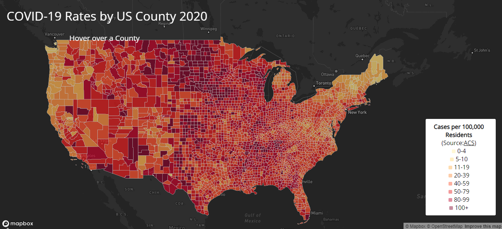
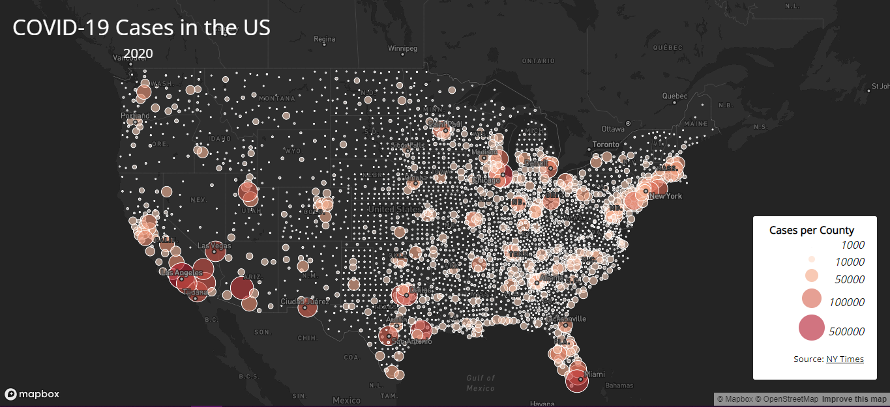

# covid-maps
### By Samuel Affolder
---

## About
covid-maps is a web map application project that uses data about COVID-19 in 2020 to visualize two different interactive web maps.
## Maps
### COVID-19 Rates by US County 2020
**[Link to interactive web map](map1.html)**

The choropleth map above shows that when the COVID-19 cases data is normalized by population data, the more populated areas of the country are actually subject to lower rates of COVID-19.  If you click on the link above, you are able to hover over any county and are told what the rate is for that county.
### COVID-19 Cases in the US by County 2020
**[Link to interactive web map](map2.html)**

The above proportionality map shows each US counties # of cases of COVID-19 in 2020.  This shows that larger centers of population tend to have higher counts of COVID-19 cases.  As shown by the map above however, this is not an accurate picture of the percentage of people to contract COVID-19.  If you click on the link above you can click on a dot to find out how many cases any given county had.
## Data
The data for the first map comes from [ACS](https://data.census.gov/cedsci/table?g=0100000US%24050000&d=ACS%205-Year%20Estimates%20Data%20Profiles&tid=ACSDP5Y2018.DP05&hidePreview=true) and it contains information on estimated population data at the county level.  Combining this information with the COVID-19 cases data from [The New York Times](https://www.census.gov/geographies/mapping-files/time-series/geo/carto-boundary-file.html) and we were able to calculate the estimated rates per 100,000 residents of a county.  The US county shapefile comes from the [US Census Bereau](https://www.census.gov/geographies/mapping-files/time-series/geo/carto-boundary-file.html)
## Credit
Credit to Bo Zhao and the TAs for doing amazing work at preparing us for this lab.